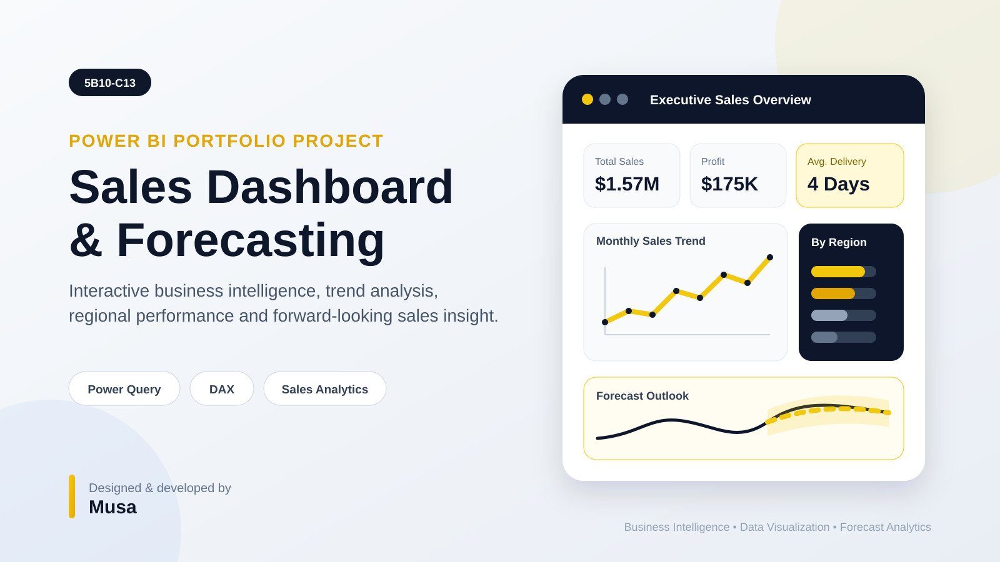

<div align="center">



<br />

# Power BI Sales Dashboard & Forecasting Assessment

**An interactive business-intelligence project for sales performance analysis, operational insight and time-series forecasting.**

[](https://powerbi.microsoft.com/)


</div>

---

## 📊 Project Snapshot

| Project Detail | Description |
|---|---|
| **Course** | Data Analytics |
| **Assessment** | Weekly Assessment 13 — `5B10-C13` |
| **Project Type** | Live Power BI dashboard and forecasting assessment |
| **Dataset** | SuperStore sales data |
| **Primary Tool** | Microsoft Power BI Desktop |
| **Core Skills** | Power Query, DAX, dashboard design and forecast analytics |

This project transforms historical sales data into a decision-ready Power BI report. It combines executive KPIs, category and regional performance, customer and payment analysis, delivery monitoring, time-based trends and forward-looking sales forecasting.

## 🎯 Business Objectives

- Build a clear, interactive sales-performance dashboard.
- Analyze results by **category, sub-category, region, segment and payment method**.
- Visualize state-level sales distribution through map analysis.
- Track monthly and yearly sales and profit movement.
- Measure average delivery performance.
- Apply Power BI forecasting to estimate future sales direction.
- Present business findings in a clean, portfolio-ready format.

## 🖼️ Report Gallery

<table>
<tr>
<td width="50%" align="center">
<strong>📈 Executive Sales Dashboard</strong><br /><br />

<br /><sub>Sales KPIs, category performance, geographic analysis, segments, payment methods and delivery metrics.</sub>
</td>
<td width="50%" align="center">
<strong>🔮 Sales Forecasting View</strong><br /><br />

<br /><sub>Historical sales trend, forecast line, confidence interval and projected future movement.</sub>
</td>
</tr>
</table>

## ✨ Dashboard Capabilities

| Analysis Area | Included Capabilities |
|---|---|
| **Executive KPIs** | Total sales, profit indicators and average delivery time |
| **Product Performance** | Category and sub-category analysis |
| **Customer View** | Segment-level contribution |
| **Regional Analysis** | Region comparison and state map visualization |
| **Order Operations** | Ship mode and delivery-performance analysis |
| **Payment Analysis** | COD, online and other payment-method contribution |
| **Trend Analysis** | Monthly and yearly sales and profit movement |
| **Forecasting** | Forecast line, confidence interval, confidence shading and zoomed outlook |

## 🧹 Data Preparation Workflow

The data was prepared in **Power Query** before visualization:

1. Promoted the first row to column headers.
2. Corrected corrupted or unclear column names.
3. Removed unnecessary fields.
4. Standardized data types.
5. Cleaned return-status values.
6. Prepared date fields for trend analysis and forecasting.
7. Structured the model for interactive Power BI reporting.

## 🔍 Key Findings

> The dashboard converts raw transactional data into a concise management view that supports both retrospective analysis and future planning.

- **Office Supplies** generated the highest sales among the major categories.
- **Standard Class** was the most frequently used shipping mode.
- **COD and Online payments** made strong contributions to total sales.
- Sales performance varied meaningfully across regions and states.
- Historical patterns supported a forward-looking sales forecast with a confidence range.

## 🧰 Technology Stack

```text
Microsoft Power BI Desktop
├── Power Query — data cleaning and transformation
├── DAX — analytical measures and calculations
├── Data Model — relationships and reporting structure
├── Interactive Visuals — slicers, maps, charts and KPI cards
└── Forecast Analytics — trend projection and confidence interval
```

## 📁 Repository Deliverables

| File Type | Purpose |
|---|---|
| `.pbix` | Editable Power BI project and interactive report |
| `.pdf` | Portable report preview or assessment submission |
| `README.md` | Project documentation and portfolio presentation |
| `assets/` | Project cover and supporting visual assets |

## 🚀 How to Explore the Project

1. Clone or download this repository.
2. Open the `.pbix` project using **Microsoft Power BI Desktop**.
3. Review the executive dashboard page.
4. Use slicers and filters to explore specific regions and business segments.
5. Open the forecasting page to review projected sales and the confidence interval.
6. Use the PDF version when Power BI Desktop is unavailable.

## ✅ Final Output

The completed report includes:

- An interactive sales dashboard.
- A dedicated forecasting page.
- Business KPI cards and comparative visualizations.
- Regional, product, customer and operational analysis.
- Historical sales and profit trends.
- A forecast view with confidence shading.

---

<div align="center">

## 👤 Author

### **Musa**

*HR Professional • Data Analytics Practitioner • Power BI Project Builder*

<br />

**Built as an academic assessment and portfolio demonstration.**

</div>
